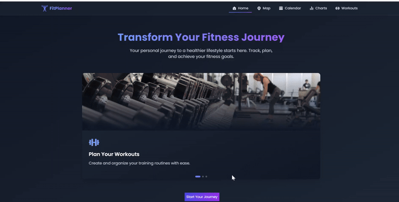

# Fit Planner 🚀



Fit Planner is a comprehensive web application designed to help users plan, track, and manage their fitness routines. It allows users to create workout plans, schedule sessions, visualize progress with charts, and find nearby training spots for outdoor workouts. Fit Planner makes staying fit organized, engaging, and motivating.

## Table of Contents 📋

- [Features](#features-)
- [Getting Started](#getting-started-)
  - [Prerequisites](#prerequisites-)
  - [Installation](#installation-)
  - [Running the Application](#running-the-application-)
  - [Backend Setup](#backend-setup-)
- [Usage](#usage-)
- [Technologies Used](#technologies-used-)
- [Road Map](#roadmap-️)
- [Contributing](#contributing-)
- [License](#license-)

## Features 🌟

- **Create Workouts**: Users can easily create custom workout sessions, selecting the type of workout, duration, intensity, and more.
- **Full Calendar Integration** 🗓️: Schedule workouts directly on a calendar, allowing efficient tracking and management of fitness activities.
- **Progress Visualization** 📊: Monitor progress with dynamic and interactive charts showing calories burned, workout types, and intensity over time.
- **Training Spots Finder** 📍: Search and save outdoor training spots near you, making it easy to find locations such as gyms, yoga clubs, and parks.

## Getting Started 🏁

To get a copy of the project up and running on your local machine, follow the instructions below.

### Prerequisites 📦

- **Node.js** (v14 or higher)
- **npm** (v6 or higher) or **yarn**
- **Mapbox API Key** (to use map functionalities)

### Installation 💻

1. **Clone the repository**:
   
   ```bash
   git clone https://github.com/IMMaribel/fitness-planner-reactplugins-mysql
   ```

2. **Navigate into the project directory**:
   
   ```bash
   cd fitness-planner-reactplugins-mysql
   ```

3. **Install dependencies**:
   
   ```bash
   npm install
   ```
   or
   
   ```bash
   yarn install
   ```

4. **Set up environment variables**:
   - Create a `.env` file in the root directory and add the following variables:

   ```env
   REACT_APP_MAPBOX_ACCESS_TOKEN=pk.eyJ1IjoibWFyaWJlbDciLCJhIjoiY20za3BuM2UzMGV1bzJyczlwYnNocXlldCJ9.CWEUVYsCagxJ9xT-_ieVsA
   ```

### Running the Application 🚀

- **Development Mode**:

  ```bash
  npm start
  ```
  or
  
  ```bash
  yarn start
  ```

- **Production Build**:

  ```bash
  npm run build
  ```
  or
  
  ```bash
  yarn build
  ```

### Backend Setup 🌐

To get the backend up and running:

   1. **Navigate to the backend directory**:

      ```bash
      cd fitnessplanner_db

   2. **Install dependencies:**

      ```bash
      npm install

   3. **Set up the MySQL database:**

      ```bash
      mysql -u your_username -p < database.sql

   4. **Configure environment variables:**

      DB_HOST=localhost
      DB_USER=your_username
      DB_PASSWORD=your_password
      DB_NAME=fit_planner
      PORT=5000

   5. **Run the backend server:**

      ```bash
      npm start

## Usage 📖


1. **Homepage** 🏠:
   - Explore the homepage to get an overview of the app's functionalities.
   - The homepage features a carousel showcasing app features like "Create Workouts", "Track Progress", and "Find Training Spots".

2. **Workouts Page** 🏋️‍♂️:
   - Create, update, and delete workouts easily. Workouts can be filtered by type, intensity, and duration.

3. **Calendar Page** 📅:
   - Add workouts to the calendar for efficient tracking and scheduling.
   - View, modify, or delete events directly from the calendar.

4. **Charts Page** 📊:
   - Visualize workout data with attractive bar and line charts. Monitor calorie expenditure and track workout distribution.

5. **Map Page** 🗺️:
   - Use the integrated map to search and save workout locations like gyms, parks, and yoga clubs.
   - Add custom markers to save new training spots.

## Technologies Used 🛠️

- **Frontend**: React, Tailwind CSS
- **Routing**: React Router
- **State Management**: Context API
- **Calendar Integration**: FullCalendar
- **Mapping**: Mapbox GL
- **Charts**: Chart.js
- **Backend**: Node.js, Express, MySQL (for CRUD operations)

## Roadmap 🛤️

- **Version 2.0**:
- Implement user authentication.
- Add support for diet and nutrition tracking.
- Integration with wearable devices for real-time workout data.
- Improve edit modal in calendar.

## Contributing 🤝

Contributions are always welcome! If you'd like to contribute:

1. **Fork** the repository.
2. **Create** a new branch for your feature (`git checkout -b feature/your-feature-name`).
3. **Commit** your changes (`git commit -m 'Add some feature'`).
4. **Push** to the branch (`git push origin feature/your-feature-name`).
5. **Open** a Pull Request.

Please make sure to update tests as appropriate.

## License 📜

This project is licensed under the MIT License. See the [LICENSE](LICENSE) file for details.

